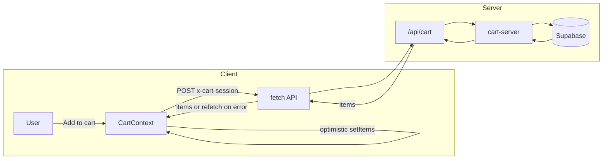

# Jairus Car Shop – Complete Project Prompt

This document is the full project specification. It covers front-end, backend, database, configuration, data flow, and conventions so the project can be understood or recreated from this prompt alone.

---

## 1. Project overview

- **Name:** Jairus Car Shop
- **Tagline:** "Sa akin quality at mura, san kapa."
- **Purpose:** Philippine car e-commerce: browse cars (Toyota, Mitsubishi, Honda), add to cart, checkout with customer details. Cart and orders are persisted in Supabase.
- **Tech summary:** Next.js 16 (App Router), React 18, TypeScript, Tailwind CSS, Framer Motion, Radix UI (shadcn-style), Supabase (cart + orders).
- **Repo layout:** Next.js app at repo root. `src/` holds the app, components, lib, context, data, hooks, and types. `supabase/schema.sql` defines the database schema.

---

## 2. Front-end

### Framework and routing

- Next.js 16 with App Router.
- Routes:
  - `/` – Home and product catalog
  - `/cart` – Cart page (list, subtotal, proceed to checkout)
  - `/checkout` – Checkout page (opens CheckoutModal when cart has items)
  - `/api/cart` – API route for cart (GET/POST)

### Global state

- React Context provides cart state and actions.
- **Single source of truth:** `CartProvider` in `src/context/CartContext.tsx` holds items, totalItems, subtotal, loading/error, and actions. The Navbar (Header) and Add to Cart components both consume it via `useCart()` from `src/hooks/useCart.ts`.

### Key components

**Layout**

- `src/components/layout/AppLayout.tsx` – Wraps the app with `CartProvider`; hosts Layout and CartDrawer.
- `src/components/layout/Header.tsx` – Logo, navigation, cart icon with item-count badge.
- `src/components/layout/Navigation.tsx` – Desktop links plus mobile hamburger menu.
- `src/components/layout/Footer.tsx` – Tagline, links, copyright.

**Catalog**

- `src/components/features/FilterBar.tsx` – Search input and brand filter (All, Toyota, Mitsubishi, Honda).
- `src/components/features/ProductGrid.tsx` – Responsive grid of ProductCards.
- `src/components/features/ProductCard.tsx` – Car image, brand badge, model, specs, price, Add to cart button with loading (“Adding…”) and “Added!” feedback.

**Cart**

- `src/components/features/CartDrawer.tsx` – Sheet from the right; cart list, quantity controls, subtotal, clear, checkout link.
- `src/components/features/CartItem.tsx` – Single cart row (image, model, brand, price, quantity controls, remove).
- `src/components/features/EmptyCart.tsx` – Empty state with link back to catalog.

**Checkout**

- `src/components/features/CheckoutModal.tsx` – Dialog with form (name, address, phone), order summary, confirm button, and success state.

### UI primitives

- shadcn-style components under `src/components/ui/`: Button, Input, Label, Sheet, Dialog.
- Dialog and Sheet each require a `DialogTitle` for Radix accessibility; a visually hidden Title (e.g. via `title` prop and `sr-only` class) is used where the visible heading is separate.

### Data and types

- **Static car list:** `src/data/cars.ts` – 15 cars across Toyota, Mitsubishi, Honda; `getCarById(id)` for lookups.
- **Constants:** `src/data/constants.ts` – BRANDS, CART_STORAGE_KEY, CART_SESSION_KEY.
- **Types:** `src/types/index.ts` – `Brand`, `Car`, `CartItem`, `CheckoutForm`.

### Cart UX (optimistic + API)

- On Add to cart: CartContext updates local state immediately (optimistic), sets `addingId` for the product, then `fetch` POST to `/api/cart` with body `{ action: 'add', carId, quantity }` and header `x-cart-session` (session id from localStorage). On success, state is replaced with the API response `items`; on failure, cart is refetched (GET) and `error` is set. The Add to cart button is disabled and shows “Adding…” for that product while the request is in flight.

### Styling and accessibility

- **Styling:** Tailwind CSS. Theme in `tailwind.config.ts` (CSS variables for primary, secondary, accent, radius, fonts). Base styles and variables in `src/app/globals.css`.
- **Accessibility:** Semantic HTML; ARIA where needed; Dialog/Sheet include a Title (visible or sr-only); focus and keyboard support.

---

## 3. Backend (API)

- **Single API route:** `src/app/api/cart/route.ts`
  - **GET:** Reads session id from header `x-cart-session` or query `sessionId`. Returns `{ items }` from Supabase via server-side cart helpers (`src/lib/supabase/cart-server.ts`).
  - **POST:** Body `{ action: 'add' | 'update' | 'remove' | 'clear', carId?, quantity? }`. Session id same as GET. Calls server Supabase helpers; returns updated `{ items }` (or `items: []` for clear). Uses `NextRequest`/`NextResponse` and try/catch for errors.
- **Checkout:** Orders are created from the client via `createOrder()` in `src/lib/supabase/orders.ts` (Supabase client) inside CheckoutModal; there is no dedicated checkout API route.
- **Session:** Anonymous; no auth. Session id is a UUID stored in localStorage (`CART_SESSION_KEY`) and sent with every cart API request.

---

## 4. Database (Supabase)

- **Schema:** `supabase/schema.sql` (run once in Supabase SQL Editor).
  - **cart_items:** id (uuid), session_id (text), car_id (text), quantity (int), created_at; unique(session_id, car_id).
  - **orders:** id (uuid), session_id (text), customer_name, customer_address, customer_phone, total (numeric), created_at.
  - **order_items:** id (uuid), order_id (FK to orders, on delete cascade), car_id, quantity, unit_price, created_at.
- **Indexes:** cart_items(session_id), orders(created_at desc), order_items(order_id).
- **RLS:** Enabled on all three tables; policies allow all for anonymous use (no auth).
- **Client vs server:** Browser uses `src/lib/supabase/client.ts` (lazy singleton, `getSupabase()`). API route uses `src/lib/supabase/server.ts` (`getSupabaseServer()`). Cart mutations in the API use `src/lib/supabase/cart-server.ts`; orders are written from the client in `src/lib/supabase/orders.ts`.

---

## 5. Configuration

### Environment

- `NEXT_PUBLIC_SUPABASE_URL` – Supabase project URL.
- `NEXT_PUBLIC_SUPABASE_ANON_KEY` – Supabase anon public key.
- See `.env.example`; copy to `.env.local` and fill in values. Do not commit `.env.local`.

### Build and tooling

- **package.json:** Scripts `dev`, `build`, `start`, `lint`, `lint:fix`, `format`, `type-check`. Node >=20, npm >=10. Overrides: minimatch ^9.0.6.
- **next.config.mjs:** `images.remotePatterns` for `images.unsplash.com` only.
- **tsconfig.json:** Paths `@/*` → `./src/*`; strict; Next plugin.
- **tailwind.config.ts:** Content under `src`; theme extend (colors from CSS vars, radius, fonts, animations); tailwindcss-animate.
- **vercel.json:** buildCommand, outputDirectory `.next`, installCommand, framework nextjs. Do not add `rootDirectory` (invalid in Vercel schema). If the app lives in a subfolder, set Root Directory in Vercel Project Settings instead.
- **Linting/formatting:** ESLint (TypeScript + Prettier), Prettier.

---

## 6. Data flow

**Cart flow (summary):** User clicks Add to cart → CartContext updates state optimistically and sets addingId → fetch POST /api/cart with session id → API uses cart-server and Supabase → response items replace state; on error, refetch GET and set error; addingId cleared in finally.

**Checkout flow:** User submits form in CheckoutModal → validate → createOrder (client Supabase: insert orders + order_items) → clearCart (via context / API) → show success state.

---

## 7. Conventions and constraints

- **Currency:** Philippine Peso (PHP). Format with `formatPrice()` in `src/lib/utils.ts`: `₱` plus `toLocaleString('en-PH')`.
- **Images:** Next.js `Image` component; URLs from Unsplash; allowlisted in next.config.
- **Accessibility:** Every Dialog and Sheet must have a Title (visible or sr-only) so Radix can associate it with the content.
- **Errors:** Cart API errors surface via context `error` and refetch; checkout submit errors are shown inside the modal.

---

## 8. Setup instructions

1. Clone the repository and install dependencies: `npm install`
2. Copy `.env.example` to `.env.local` and set `NEXT_PUBLIC_SUPABASE_URL` and `NEXT_PUBLIC_SUPABASE_ANON_KEY`
3. In Supabase Dashboard, create a project and run the contents of `supabase/schema.sql` in the SQL Editor
4. Run the app: `npm run dev`

**Vercel:** If the Next.js app is in a subfolder (e.g. `starter-pack`), set **Root Directory** in Vercel Project Settings (General), not in `vercel.json`. The `vercel.json` schema does not allow a `rootDirectory` property.
